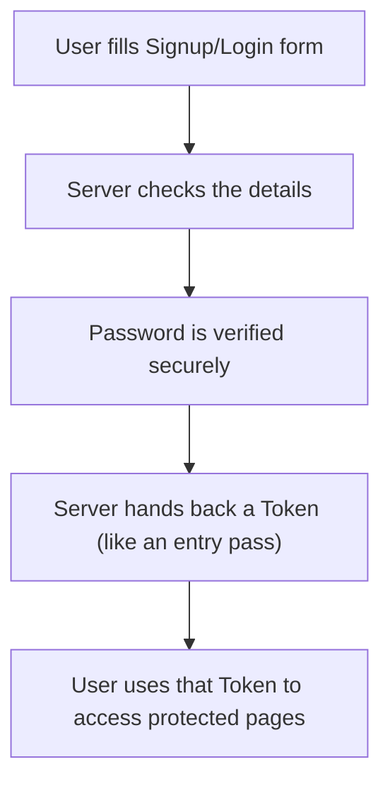

# Authentication API 🔐

A secure, production-style backend service that handles **user signup, login, and login sessions** — the kind of system every app (Instagram, Amazon, Gmail...) needs behind the scenes to know *who you are* and keep your account safe.

> 🎓 This is my **first internship project** — built to understand how real-world authentication systems work under the hood.

---

## What does this actually do?

Imagine every website as a building with a receptionist at the front desk. Before you can go inside and use anything, the receptionist needs to:

1. **Check your ID** when you sign up (make sure you're a real person, your email is valid, your password is strong)
2. **Give you a visitor badge** when you log in (a "token" that proves you're allowed to be there)
3. **Check that badge** every time you try to enter a private room (like your profile or dashboard)
4. **Let you renew your badge** without asking for your password again and again
5. **Take the badge back** when you leave (logout)

This project **is that receptionist** — but for a web app, built entirely in code.

It also supports **"Sign in with Google"**, the same one-click login button you see on most apps, so users don't even need to create a password if they don't want to.

---

## Why this matters (the technical side)

Almost every app needs authentication, and doing it *wrong* is one of the most common ways apps get hacked. This project follows patterns used in real production systems:

- **Passwords are never stored as plain text** — they're hashed with `bcrypt` before touching the database, so even if the database leaks, passwords aren't exposed.
- **Two types of tokens (Access + Refresh)** instead of one — a short-lived "access token" for daily use, and a longer-lived "refresh token" to get a new access token without forcing the user to log in again. This is the same pattern banking and social media apps use.
- **Input validation** on every signup/login request (via `express-validator`) — rejects bad emails, weak passwords, and malformed data before it ever reaches the database.
- **Google OAuth 2.0** — lets users log in with their Google account instead of creating a new password.
- **Role-based accounts** — users are tagged as `buyer` or `seller`, so different account types can be supported later.
- **Security headers** via `helmet`, and strict `cors` rules, to reduce common web attack surfaces.

---

## How a request flows through the system



---

## Features

- ✅ **Register** — create an account with email, password, full name, and contact number
- ✅ **Login** — authenticate with email + password
- ✅ **Google Login** — one-click sign-in via Google OAuth
- ✅ **Get current user** — fetch the logged-in user's profile
- ✅ **Refresh token** — get a new access token without logging in again
- ✅ **Logout** — securely end a session
- ✅ **Role-based access** — supports `buyer` and `seller` account types, with a separate middleware guard for seller-only routes

---

## API Reference

Base URL: `/api/auth`

| Method | Endpoint           | Access  | What it does                                             |
|--------|---------------------|---------|------------------------------------------------------------|
| POST   | `/register`          | Public  | Create a new account                                        |
| POST   | `/login`              | Public  | Log in with email + password, returns tokens                |
| GET    | `/me`                 | Private | Get the logged-in user's own details                        |
| POST   | `/logout`             | Private | Log out and invalidate the refresh token                    |
| GET    | `/refresh`            | Private | Exchange a valid refresh token for a new access token        |
| GET    | `/google/`            | Public  | Start "Sign in with Google" flow                             |
| GET    | `/google/callback`    | Public  | Google redirects here after login; account is created/found |

### Example: Register

**Request**
```http
POST /api/auth/register
Content-Type: application/json

{
  "email": "user@example.com",
  "password": "mySecurePass123",
  "fullname": "Jane Doe",
  "contact": "9876543210",
  "isSeller": false
}
```

**Response** `200 OK`
```json
{
  "success": true,
  "message": "User registered successfully",
  "accessToken": "eyJhbGciOi...",
  "refreshToken": "eyJhbGciOi...",
  "user": {
    "id": "665f1c2a9b1e2a0012345678",
    "email": "user@example.com",
    "contact": "9876543210",
    "fullname": "Jane Doe",
    "role": "buyer"
  }
}
```

---

### Example: Login

**Request**
```http
POST /api/auth/login
Content-Type: application/json

{
  "email": "user@example.com",
  "password": "mySecurePass123"
}
```

**Response** `200 OK`
```json
{
  "success": true,
  "message": "User logged in successfully",
  "accessToken": "eyJhbGciOi...",
  "refreshToken": "eyJhbGciOi...",
  "user": {
    "id": "665f1c2a9b1e2a0012345678",
    "email": "user@example.com",
    "contact": "9876543210",
    "fullname": "Jane Doe",
    "role": "buyer"
  }
}
```

> The access token is also automatically set as a secure, `httpOnly` cookie — you don't have to store it manually if you're calling this from a browser.

---

### Example: Get Current User (`/me`)

**Request**
```http
GET /api/auth/me
Cookie: token=eyJhbGciOi...
```

**Response** `200 OK`
```json
{
  "success": true,
  "message": "User fetched successfully",
  "user": {
    "id": "665f1c2a9b1e2a0012345678",
    "email": "user@example.com",
    "contact": "9876543210",
    "fullname": "Jane Doe",
    "role": "buyer"
  }
}
```

**If the token is missing or invalid** → `401 Unauthorized`
```json
{
  "success": false,
  "message": "Unauthorized"
}
```

---

### Example: Refresh Token

Used when the access token expires — instead of logging in again, the app exchanges the refresh token for a fresh access token.

**Request**
```http
GET /api/auth/refresh
Content-Type: application/json

{
  "refreshToken": "eyJhbGciOi..."
}
```

**Response** `200 OK`
```json
{
  "success": true,
  "accessToken": "eyJhbGciOi... (new one)"
}
```

**If the refresh token is invalid or expired** → `401 Unauthorized`
```json
{
  "success": false,
  "message": "Invalid or expired refresh token"
}
```

---

### Example: Logout

**Request**
```http
POST /api/auth/logout
Content-Type: application/json

{
  "refreshToken": "eyJhbGciOi..."
}
```

**Response** `200 OK`
```json
{
  "success": true,
  "message": "Logged out successfully"
}
```

This clears the refresh token from the database and removes the auth cookie, so the old tokens can no longer be used.

---

## Tech Stack

| Layer            | Technology                                   |
|-------------------|-----------------------------------------------|
| Runtime           | Node.js                                        |
| Framework         | Express 5                                      |
| Database          | MongoDB (via Mongoose)                         |
| Authentication    | JWT (access + refresh tokens), bcrypt, Passport.js (Google OAuth 2.0) |
| Validation        | express-validator                              |
| Security          | Helmet, CORS                                   |
| Dev tooling       | Nodemon, dotenv                                |

---

## Project Structure

```
Authentication-Api/
└── backend/
    ├── server.js              # entry point — starts the server & connects to DB
    ├── package.json
    └── src/
        ├── app.js              # sets up Express, middleware, and routes
        ├── config/
        │   ├── config.js       # loads & validates environment variables
        │   └── db.js           # connects to MongoDB
        ├── controller/
        │   └── auth.controller.js   # business logic: register, login, logout, etc.
        ├── middleware/
        │   └── auth.middleware.js   # checks if a request has a valid token
        ├── models/
        │   └── user.model.js   # defines what a "user" looks like in the database
        ├── routes/
        │   └── auth.routes.js  # maps URLs (like /login) to the right controller function
        ├── utils/
        │   └── token.js        # generates access & refresh tokens
        └── validator/
            └── auth.validator.js  # checks incoming data is valid before processing it
```

---

## Running It Locally

### 1. Prerequisites
- Node.js installed
- A MongoDB database (local, or a free one from [MongoDB Atlas](https://www.mongodb.com/atlas))
- A Google Cloud project with OAuth credentials ([Google Cloud Console](https://console.cloud.google.com/))

### 2. Install dependencies

```bash
cd backend
npm install
```

### 3. Create a `.env` file inside `backend/`

```env
MONGO_URI=your_mongodb_connection_string
JWT_SECRET=some_random_secret_string
JWT_ACCESS_SECRET=another_random_secret_string
JWT_REFRESH_SECRET=yet_another_random_secret_string
ACCESS_TOKEN_EXPIRE=15m
REFRESH_TOKEN_EXPIRE=7d
GOOGLE_CLIENT_ID=your_google_client_id
GOOGLE_CLIENT_SECRET=your_google_client_secret
CLIENT_URL=http://localhost:5173
NODE_ENV=development
PORT=3000
```

> All of these variables are required — the app will refuse to start if any are missing (this is intentional, to avoid accidentally running with insecure defaults).

### 4. Start the server

```bash
npm run dev
```

The API will be running at `http://localhost:3000`.

---

## Known Limitations

- No automated test suite yet (`npm test` is currently a placeholder).
- The Google OAuth redirect URL after login is hardcoded to `http://localhost:5173` — update this for production use.
- No `.env.example` file is included yet — use the template above.
- This is a **standalone auth service** — it's designed to be plugged into a frontend or another backend, not to be a complete app on its own.

---

## What I Learned

Building this taught me how login systems actually work behind the "Sign In" button — password hashing, why apps use two tokens instead of one, how OAuth logins work without ever seeing a user's Google password, and how to validate and secure incoming data before it touches a database.

---
